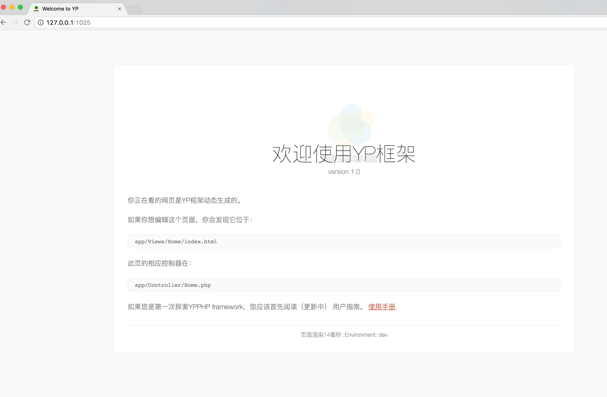

# YPPHP
 A Frame Of PHP

 以下是框架的目录结构

 ```
 app
  |
  |____Config
  |      |---- 各种的用户的配置目录
  |____Controllers
  |      |---- 各种控制器
  |____Core
  |      |---- 框架核心文件复写目录
  |____Functions
  |      |---- 公共函数库
  |____Libraries
  |      |---- 各种工具类库目录
  |____Models
  |      |---- 各种用户模型目录
  |____ThirdParty
  |      |---- 第三方组件目录
  |____Views
         |---- 视图目录
  public
  |____index.php
  |      |---- 框架入口
  |____Static
         |---- 前端静态资源目录
  artisan
         |---- 框架的命令工具
  system
  |   |----框架目录
  |____Core
  |      |____Functions.php
  |      |      |---- 框架自用函数文件
  |      |____Controller.php
  |      |      |---- 基类控制器
  |      |____Exceptions.php
  |      |      |---- 异常处理类
  |      |____Hooks.php
  |      |      |---- 各种钩子处理类
  |      |____Log.php
  |      |      |---- 日志类
  |      |____Model.php
  |      |      |---- 基类model
  |      |____Router.php
  |      |      |---- 路由处理类
  |      |____Url.php
  |      |      |---- URL处理类
  |      |____Utf8.php
  |      |      |---- 编码处理类
  |      |      |---- URL处理类
  |      |      |____Utf8.php
  |      |             |---- 编码处理类
  |____Libraries
  |      |____FormValidation.php
  |      |      |---- 表单验证类
  |      |____Page.php
  |      |      |---- 分页类
  |      |____Upload.php
  |             |---- 上传类
  |____bootstrap.php
  |      |---- 框架启动文件
  |____autoLoad.php
  |      |---- 自动加载文件
  |----Functions.php
  |      |----框架函数库
  |____YP.php
         |----模块连接处理器


 ```
 框架采用以下第三方组件

 - [x] ORM数据库工具 Eloquent
 - [x] Doctrine2
 - [x] Symfony2 Console
 - [x] Json-schema Json 请求字符串验证
 - [x] Twig 模板工具
 - [x] PHPMailer 邮件工具
 - [x] PHPExcel Excel工具
 - [x] Thrift

 ## 框架快速上手
 因为这框架所依赖的第三方组件都采用的是Composer管理, 所以在使用YP框架之前,请确保本地已安装**Composer**包管理软件,关于Composer的安装在此不再详细说明,
 如果本地已安装Composer包管理软件, 接下来在本地克隆该框架,在命令行中输入

 ```sh
 git clone  https://github.com/ly2513/YPPHP.git

 #或者

 git clone git@github.com:ly2513/YPPHP.git
 ```
 克隆下来后,在框架的根目录(YPPHP/)执行下命令

 ```php
 composer update
 ```
将框架所需要依赖的第三方组件更新到本地, 根目录下将会创建一个**vendor**文件夹,该目录下存放着框架所依赖的第三方组件。更新完成后,进入到根目录下的**public**目录下,输入命令

 ```php
 php -S 127.0.0.1:1025
 ```
 回车,你将看到如下界面




## 命令行工具

 ```
 php artisan list
 ```

### Doctrine

```
# 数据表转 yml 映射文件(已支持字段注释直接转化为yml文件)
php artisan doctrine:orm:convert-mapping --from-database yml app/ThirdParty/Doctrine/Mappings
# 生成 Entity 文件
php artisan doctrine:orm:generate-entities app/ThirdParty/Doctrine/Entity
# 查看 更新SQL
php artisan doctrine:orm:schema-tool:update --dump-sql
# 执行更新
php artisan doctrine:orm:schema-tool:update --force
```
### Thrift

```
# 生成Thrift文件
php artisan thrift:create -f  Thrift文件名称
# 编译Thrift文件
php artisan thrift:gen -p app/ThirdParty/Thrift/Thrift/shared.thrift(thrift文件)
```

